# Tools-and-Instructions

Tools-and-Instructions 如何成为录男 推荐的工具和一些指导 (以及本人的工作流程揭秘)

目录：

[toc]

## 故事（我的一些絮絮叨叨，可跳过）

去年(2022年)九月份的时候，我开始看b站[可爱大蚂蚁](https://space.bilibili.com/12695676/)的直播，从此对红警2对战圈产生了浓厚的兴趣。

每当我接触到新的一个圈子的时候，对我来说最让我感兴趣的一件事就是考古。当时的我开始通宵在b站找红警2历届大赛的比赛视频以及选手。

虽然红警2大赛的视频往往都散落各处，但是通过寻找一些高播放视频以及关注一些对战圈知名up主，我很快锁定了现在的世界第一高手：威龙。

当时那些威龙比赛的视频中，我比较喜欢的有许多是他与国外高手对战的视频，主要都是在[\_SharaX\_](https://space.bilibili.com/24322830)那里看的。那一阵子我可以通宵看威龙的比赛视频，几乎把那个号最近所有和威龙相关的比赛视频全部看完了。看完之后又发现威龙原来也在b站直播，但是我很少看见他的直播录像，为数不多的录像是在[作业用BGM](https://space.bilibili.com/8351235)这个号上看到的。

威龙的比赛实在是特别有观赏性，我很快成为他的粉丝(当然也可能是因为我比较喜欢当冠军粉，谁不喜欢实力最强的选手呢？)。然而看完之前的比赛之后，我也有一些观看方面的感受，或者说是不满：

- 红警的比赛视频大多是观赛者(主播)或者甚至是观众录制的，视频质量参差不齐，来源很杂，很容易找不到比赛录像。
- 红警赛事通常没有专门的赛事页，需要加入赛事报名群才能获得*部分信息*，大部分时候还是要在几位知名主播(藏龙，蚂蚁)的直播间蹲比赛信息。***这一点在兰博玩开设赛事页面后有所好转***
- 一些威龙打的国外赛事在b站看不到。***这些视频在油管上。老外的直播和录像做的其实挺不错的，很值得学习***
- 威龙的直播时间不太固定，也没有直播回放，对于上学或者上班的人来说，很难看到他的直播。***他也没有专门的录播组。***

基于以上感受，加上我对于红警对战的强烈兴趣，与其等待有人来优化这些问题，不如自己先做一些力所能及的事情来改善现状。于是在 10 月初的一天，我将我一个废弃的视频号清理了一下，修改了用户名，开始了 wudi_7mi 的故事。

一开始我最简单的想法是把油管上的一些威龙相关比赛视频搬运到b站上。当时油管上还是有一些威龙比赛视频的更新的，主要都在 [Fortune&#39;s Chaos](https://www.youtube.com/c/FortunesChaos)这个频道上。这个频道应该是由 Mj_vst 和 Matt 一起运营的，当时隔几天会发一场比赛录像，我就直接搬运到b站，很快获得了一些播放量和粉丝。

接着就是开始上传直播录像。开始直播录像之前我花了一些时间研究了如何将弹幕嵌入视频，初期的嵌入都是手动在命令行里输入完成的，要耗费不少时间。这个时候开始有不少威龙的粉丝也开始关注这个账号，并表示终于看到威龙有录播组了。

那时我其实和其它的粉丝与主播并没有什么交流——我既没有加入任何群，也没有和圈内的人交流过，那段时候是一个人闷头自己做，现在看来显然是不够明智，当然有部分原因是因为我也不知道这样传录播、搬运视频是否“合法”，也不知道这样的行为是否会引来争议。

印象中我一直到2022年12月份才加入了威龙的粉丝群，当时进去的时候立马就有人欢迎了我，管理员也修改了公告表示可以在我这里看直播录像和比赛搬运。从这时我才发现自己很多想法是多余的，也是从这个时候开始我的粉丝量开始稳定的上升，更多人开始了解这个账号。这个时候我已经将自己的头像改成了乌龟的头像🐢，我是特别喜欢这个乌龟表情，自己也为这个乌龟的形象做了一些工作，包括表情包，很快有不少人就直接称我为大乌龟了。

那之后开始的第二届风云杯双人挑战赛，是我第一次全程传威龙比赛录像的赛事，每一场我都从主播那里录像然后剪辑上传。虽然总共只有四场，但是想要全部赶上还是没那么容易，决赛的3个小时长视频也给录像文件的处理带来困难。可以说前面的搬运和直播录像对我来说是很轻松的，而这次的比赛第一次让我感受到了不易。当然也是这场比赛让我迅速涨粉，收获了不少关注。

再下面的一场是开拓者对抗赛。这系列的赛事让我对录像处理与视频制作的水平突飞猛进。八强循环的赛制精彩而激烈，全部比赛威龙共有 11 场。期间许多粉丝对于比赛录像是否需要弹幕的问题有讨论，因为我之前的比赛录像从来都是上传没有弹幕的版本，而有些粉丝希望看到弹幕，有些则认为弹幕比较烦人。从我当时的角度我其实希望不传带弹幕的版本，因为那样的工作量小，而且带弹幕视频的剪辑很麻烦(以我那时候的视频处理水平而言耗时很长)。我当时发布了一个投票，结果发现喜欢看弹幕的观众还是居多。于是我花费了一些时间用代码专门去优化了自己处理视频的工作流，最终达到了让我很满意的视频处理效率，同时也让比赛录像带上了弹幕。这次的优化经历也让我有时间处理更多的录像，于是从这系列赛事开始，我掌握了同时录制多个主播的技巧，从而能够上传同场比赛多个视角的录像，让各个主播的粉丝都能愉快地观看比赛。决赛的那个视频我耗费了很多时间制作，同时上传了三个主播的视角(蚂蚁、土豆、藏龙)，那个视频播放量很高，我的粉丝数也成功突破了 500。

那场比赛的决赛赛后有一个采访，这个采访我一时兴起想要做个带字幕的版本发布出去，于是锻炼了一下做字幕的能力，直接挑战制作有多人说话的视频字幕还是很困难的，构思和实现耗费了我一些时间，但感觉是值得的。

那之后我又开始尝试做了一些威龙相关的自制视频。第一个视频是过年期间，做了个算是 2022 年的总结工作：把威龙 2022 年发布视频中所有的“结束语”拼接起来，由于威龙 2022 年末解说的结束语多为“他自爆了”，我觉得这是个很有意思的点，于是搜集了他有解说的投稿，剪成了视频。最终视频效果没有让我特别满意，但是还是挺有意思的。那个视频是本账号第一个自制视频，也让很多观众看到了我幽默的一面(?)

再后面就是土豆的“老蚂啊老蚂”，那个视频主要还是土豆模仿得太像了，我感觉特别搞笑，勉强也算是和威龙沾边，所以配上茄子的画面剪了个视频。这个视频最终突破一万播放量，是我目前(截至20230215)播放量最高的视频。其实这个视频的播放量高也在意料之中，一方面这算是可以出圈的梗，自带流量；另一方面土豆本尊也在这个视频下面评论了，给这个视频带来不少关注。

## 工作流与相关工具

**在浏览下面的内容前请注意: 录播请投稿转载，不会有任何收益，直播录像不可以投自制！**

本人算是开源爱好者，因此大部分时候比较喜欢采用开源的工具。

对于本人来说平时我的账号会涉及以下的几个任务：

### 威龙直播录像



我用过最好用的b站直播录像软件： [B站录播姬](https://rec.danmuji.org/)。使用简单，可监控自动录制(可部署到服务器)，可同时录制弹幕、同时录制多个主播，稳定可靠，在我使用这个软件的半年里几乎没有出现过故障。这个软件得到的录播视频是 flv 格式。

一般来说，如果需要上传不带弹幕的录像，B站录播姬得到的 flv 格式录像就可以直接上传到b站了，直播的封面也会在录像的文件夹中为你保存，可以迅速地投稿。***如果想要超迅猛极限投稿，可以在录播姬的设置中设置录像分段，比如设置90分钟，这样主播播到90分钟时你就可以获得第一段直播录像，这时直接上传，有可能主播还没播完你的直播录像就已经通过审核了。***

处理弹幕我使用的是 [DanmakuFactory](https://github.com/hihkm/DanmakuFactory)，一个开源的弹幕格式转换工具，支持特殊弹幕(虽然用不上)。这个工具有图形化界面，也有命令行的版本。刚开始做录播的时候我使用的是图形化界面，很直观方便(记得把启用礼物框这个选项关闭)，直接将录播姬得到的 xml 弹幕原始文件转换为 ass 字幕格式的文件即可；后来做自动化之后我逐渐开始使用命令行版本。

得到 ass 字幕文件是为了嵌入视频，因为视频是没法直接让弹幕原始文件嵌入的。当视频和字幕都准备好后就可以使用 ffmpeg 进行合成了。[ffmpeg](https://ffmpeg.org) 是一个开源的强大的视频工具，需要下载并配置环境变量，这里给出一个我随意搜索的 [windows 下配置 ffmpeg 的教程](https://www.bilibili.com/read/cv13908332)。配置完成后就可以使用命令行合成，这里给出一个使用的例子：

```shell
# 假设视频文件是 wudi.flv 字幕文件是 wudi.ass 设想的输出文件名是 wudi.mp4（前两个文件需要在一个文件夹中）

ffmpeg -i wudi.flv -vf fps=fps=60,scale=1920:1080,subtitles=wudi.ass \
-b:v 6000k wudi.mp4

# 如果你是 NVIDIA 的显卡可以使用下面的命令,充分利用显卡加速

ffmpeg -hwaccel cuda -c:v h264_cuvid -i wudi.flv \
-vf fps=fps=60,scale=1920:1080,subtitles=wudi.ass \
-b:v 6000k -vcodec h264_nvenc wudi.mp4
```

最终得到了 mp4 格式的带弹幕的视频就可以上传了。

以上的流程是我刚开始做录播的时候每次工作的全部流程。如果这些操作全部由我手动完成，还是很耗时的，因此经过一些优化，我直接将视频弹幕合并的全部工作自动化，写成了一个 python 的脚本：[Add-danmaku](https://github.com/wudi-7mi/Add-danmaku)

这个脚本的主要功能就是将上面 转换字幕 合并字幕 两步工作和二为一，并且支持批量转换，只要将所有需要加字幕的视频文件和字幕文件放在一个文件夹里即可。这个 python 脚本的使用方式详见该脚本的代码仓库，我在这个脚本里还集成了 flv 直转 mp4、统计直播收入等功能。***需要注意的是由于我的摆烂，这个脚本只能在windows上使用。***

### 比赛录像

比赛通常需要去在群里或者在几个主播(蚂蚁、藏龙、土豆、阿夫赛)那里找到比赛时间，然后直接录制他们的直播即可。录制完了之后通常需要进行一些简单的剪辑，把比赛前的等待时间和比赛后的絮絮叨叨剪掉，我比较喜欢用的视频剪辑软件是 Pr (Adobe Primiere Pro)，当然用剪映等其它软件都没什么问题。导出的时候需要注意码率。根据我录像的经验，这些主播直播的码率大部分都在 6-7Mbps，所以导出视频的时候也按类似的数值导出就行，我平常为了在提高导出效率的同时不降低太多画质，码率通常设置成 6Mbps。

需要注意的是，B站录播姬输出的视频是 flv 格式的，没有办法直接导入 Pr 进行剪辑。这里要分两种情况，如果你不需要弹幕，则可以直接用 Add-danmaku 里的 flv2mp4 工具将 flv 转为 mp4，这个速度是很快的，基本几秒就可以完成；如果你需要弹幕，则和上一节里说的直播录像加弹幕的处理流程一致，需要较长的时间。

视频导出后就可以上传了，记得要在视频简介里标注好视频的来源，顺便宣传一下解说的主播。***比赛的录像和其它直播录像一样，不要投自制，要投转载！！***

### 比赛采访

比赛采访相对于制作其它视频的难点是制作字幕(如果你的要求不高也可以不做哈哈)，这里我目前用的是 [Arctime](https://arctime.org/)，因为它支持直接分析视频里的人声生成带时间轴的字幕，识别准确率还是挺高的，功能也很强大，但这个功能是需要积分的，不过每天软件签到可以获得积分，如果不够需要充值(价格不贵)。如果后面我能找到开源的软件或者语音转字幕模型的话我会替换这个方法。

关于字幕的字体选择，我一直倾向于选择开源免费的字体。我常用的字体是 [思源黑体](https://github.com/adobe-fonts/source-han-sans)，大方美观，字形覆盖广，支持多字重。

顺带一提如果是需要等宽字体的话我也推荐 [更纱黑体](https://github.com/be5invis/Sarasa-Gothic)，同样开源，中文等宽，也很美观，适合编程。

### 其它自制视频

[但是他怎么直接自爆了我靠](https://www.bilibili.com/video/BV1DY4y1d7uH/)

这个视频制作的难点在于批量下载某个 up 主的投稿。这里用到的工具是一个开源的 python 工具：[bilix](https://github.com/HFrost0/bilix)

它最大的优势是可以批量下载 up 主的投稿，并且使用 python async 异步技术，能够跑满你的网络带宽，极速下载，非常好用。

### 封面制作

我喜欢用 Ai (Adobe illustrator)，因为以前用习惯了，其实封面制作选择很多，这里不展开了。

## 未来的计划

这两年在一众红警 up 主的带领下红警对战圈涌入很多新玩家，我也是被 08，蚂蚁等人引来的普通观众。在深入地了解(水群)之后，我感受到玩家与观众都充满了热情。但是红警比赛毕竟不能与其它游戏相比，一是没有所谓的官方，二也没有职业的环境，红警大部分时候都是由爱好者和主播在维持热度，红警赛事也没有专业的团队去进行宣发、转播，有一些长存的问题，有部分我在上文的故事中已经提到了。

作为一名普通观众，我也希望多融入这个圈子、能够多看比赛、多了解一些主播。我也是想做出一些自己的贡献，下面是我的一些未来的计划：

- 今年下半年搭建录播站，收录几个红警主播的录播
- 搭建一个和威龙相关的网站(到时候我会组建一个群来出想法和维护)
- ......

如果大家对我有什么意见与建议，欢迎b站私信我，或者 [Email](wudi7mi@google.com) 也是完全可以的。

## 感谢

待更新...

<!-- 随着粉丝的增多，一些意见与建议逐渐涌现，很感谢这些对我提出自己看法的粉丝，从大家的智慧中我也在不断地提取可行的改进方案，优化视频的制作流程以及提升质量。

待更新... -->
